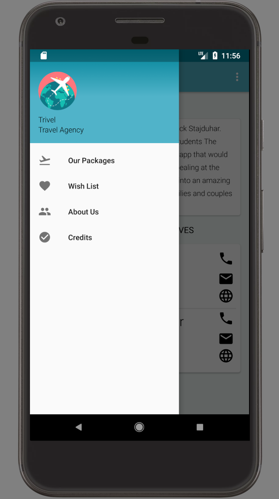
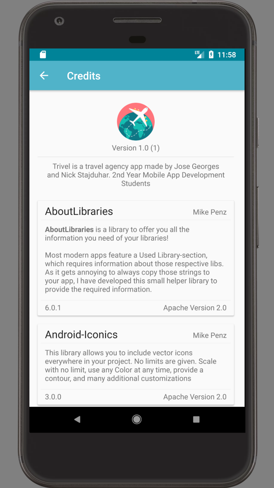
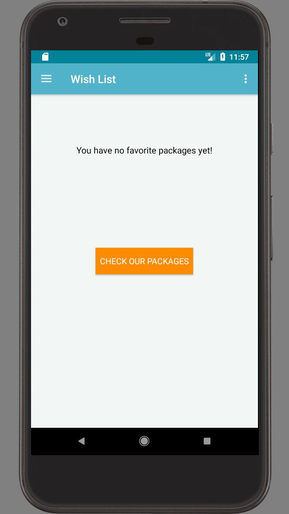
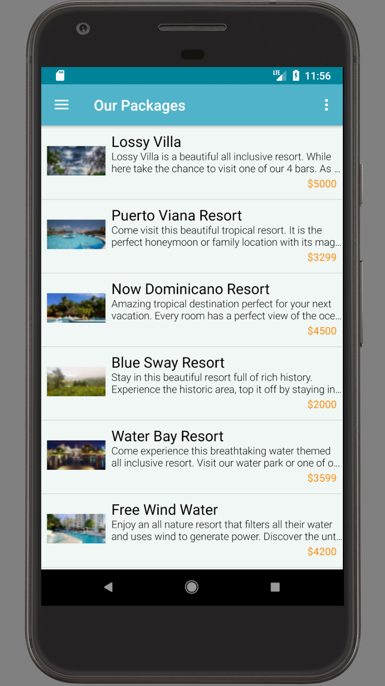
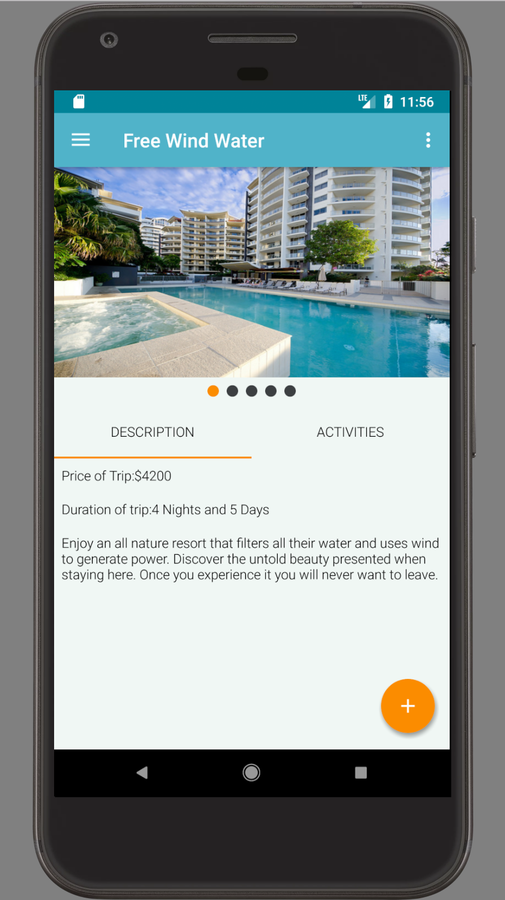
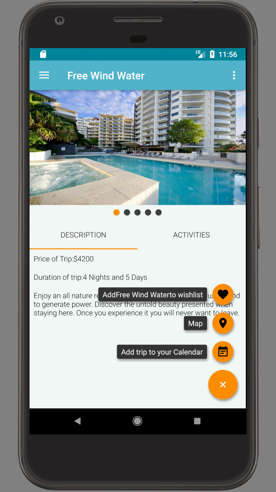
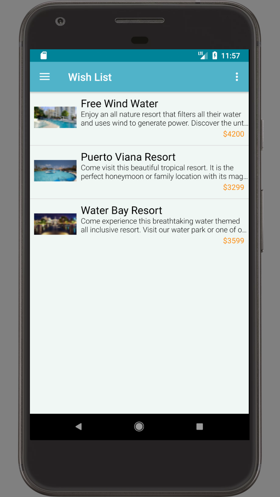

# Trivel
This is is to allow users to view different places that they would like to travel to that we offer them. This allows them to view average prices
and details of the place they are looking at. This app is designed for families and older couples who would like to travel. I feel like this would also apply
to a few in a younger audience that would like to travel the world before they start a family.
## Git Config Instructions
`git config --global user.name` `<<<YOUR NAME HERE>>>`

`git config --global user.email` `<<<YOUR EMAIL HERE>>>`

## Pictures Of our App

### Splash Screen

### About Us Page

### About Us Page With Translation to Spanish On

### Navigation Drawer

### Credits Page

### Wish List Page with no content added

### Trip Packages that the company offers

### Single Trip Package View

### Fab Button expanded

### Wish List Page with some content added

## Commiting Instructions

Download/Clone the project from the repository

Perform the Git Config Instructions

Perform a `git branch -a` to see all the branches on the github repo

'git checkout staging' so that it creates a local copy of staging you can branch from

Create a branch that branches from staging and check it out `git checkout -b branchname`

When you are ready to put your work into staging (the main project) you do the following
Checkout staging `git checkout staging`

Pull staging (ensure your local staging is up to date with the copy on origin) 'git pull'

Checkout your branch `git checkout branchname`

Merge staging into your branch (This may cause a merge conflict if staging had content it downloaded) 'git merge staging'

Fix any issues that are in your project indicated by <<<<<<head ======== >>>>>>branchname

Once all issues are fixed perform another commit `git add .` and `git commit -m “”`
Checkout staging `git checkout staging`

Perform a git pull (to ensure staging did not change while we were making fixes) `git pull`

##  IMPORTANT (if there are no changes then we can proceed. If there are changes and updates are downloaded we repeat the above steps)

If no conflicts appeared and everything is up to date you are ready for your code to make its way into staging

Push your branch to github  `git push origin branchname`

Go to GitHub and perform a pull request (possibly tag a group member to get it done faster)

## Additional Tips
Document everything you do with JavaDoc Comments

With each commit comment the issue it is addressing `git commit -m "#4 this addresses isssue number 4"`
